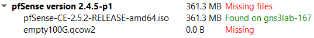

# 146 Dokumentation GNS3 konfigurieren und anwenden 

 

## __Ein Netzwerkschema in GNS3 nachbauen, verstehen und konfigurieren.__ 
 

Einleitung

Die Firma GNS3 Experts GmbH hat excellente Fachkräfte im Bereich IT-System implementur und Systemsicherheit und ist spezialisiert und zertifizierter Partner von der GNS3 GmbH.
Mit hilfe einer Virtualisierungssoftware will die Firma GNS3 Experts GmbH eine funktionierendes Netzwerk aufbauen. Eine Firewall soll mögliche Angriffe abwehren.

Was ist GNS3?
GNS3 steht für "Graphical Network Simulator-3". Er ermöglicht die Kombination von virtuellen und realen Geräten, mit denen komplexe Netzwerke simuliert werden.
Es ist vergleichbar mit dem "Cisco Packet Tracer", welcher auch virtuelle Netzwerksimulationen unterstützt. Der grosse unterschied besteht darin, dass bei GNS3 jedes Gerät im Hintergrund mit einem eigenen ISO Datei auf einem Server läuft.

Installation von GNS3
Eine Anleitung für die Installation von GNS3 findest du hier:
https://gitlab.com/alptbz/m145/-/tree/master/sections/01_intro

Bei der Installation wird zuerst der GNS3 Client installiert. Damit nicht die lokalen Ressourcen verwendet werden müssen, kann man sich auf einen GNS3 Server verbinden. Dafür wird noch der OpenVPN Community Client benötigt. Die Installation wird ebenfalls in der oben stehenden Anleitung erklärt.

GNS3 Basic's
Nachdem der GNS3 Client gestartet wurde und mit einem Server verbunden ist kann man beginnen seine Netzwerke zu basteln.

Auf der linken Seite kann man Router, Switches, End Geräte, Sicherheits Geräte und Verkabelungen hinzufügen. Die Auswähl der Geräte ist jedoch sehr begrenzt. Falls spezifische Router und Switches benötigt werden können diese unten links über den Button "New Template" hinzugefügt werden.

  
 
 
 
 

Install Fortigate Firewall
Für die Installation benötigt man noch eine ISO Datei.
Diese ISO Datei kann hier heruntergeladen werden:
https://www.pfsense.org/download/